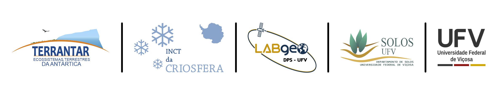
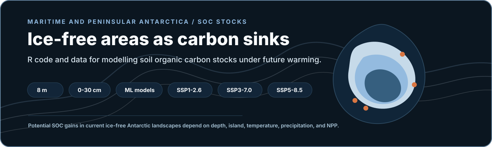
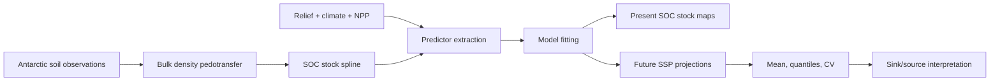
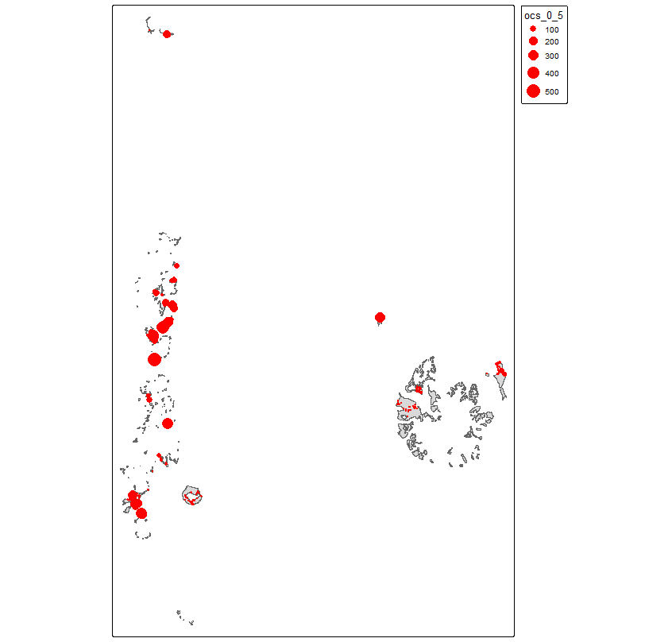

<p align="center">
  
</p>

<p align="center">
  
</p>

<h1 align="center">Global Warming May Turn Ice-Free Areas of Maritime<br>and Peninsular Antarctica into Potential Soil Organic Carbon Sinks</h1>

<p align="center">
  <strong>R scripts and datasets supporting high-resolution SOC stock modelling in Antarctic ice-free areas under climate change scenarios.</strong>
</p>

<p align="center">
  <a href="https://doi.org/10.1038/s43247-024-01937-z"></a>
  <a href="https://doi.org/10.5281/zenodo.14004139"></a>
  
  
</p>

<p align="center">
  
  
  
  
  
</p>

<p align="center">
  <a href="#paper-first">Paper First</a> |
  <a href="#at-a-glance">At A Glance</a> |
  <a href="#workflow">Workflow</a> |
  <a href="#repository-map">Repository Map</a> |
  <a href="#datasets">Datasets</a> |
  <a href="#results">Results</a>
</p>

<table align="center">
  <tr>
    <td align="center"><strong>Canonical citation</strong></td>
  </tr>
  <tr>
    <td align="center">
      de Mello, D. C.; Francelino, M. R.; Moquedace, C. M.; Baldi, C. G. O.; Silva, L. V.; Siqueira, R. G.; Veloso, G. V.; Fernandes-Filho, E. I.; Thomazini, A.; Dematte, J. A. M.; Ferreira, T. O.; Gomes, L. C.; Senra, E. O.; Schaefer, C. E. G. R. (2025).<br>
      <em>Global warming may turn ice-free areas of Maritime and Peninsular Antarctica into potential soil organic carbon sinks</em>.<br>
      <strong>Communications Earth & Environment</strong>, 6, 143. <a href="https://doi.org/10.1038/s43247-024-01937-z">https://doi.org/10.1038/s43247-024-01937-z</a>
    </td>
  </tr>
</table>

## Paper First

This repository supports the scientific article above. The article is the
canonical source for methods, results, and interpretation; this repository
organizes the R code, datasets, and links to final map products.

The study estimates soil organic carbon (SOC) stocks in current ice-free areas
of Maritime and Peninsular Antarctica and evaluates their potential response
under three Shared Socioeconomic Pathways.

## At A Glance

<table>
  <tr>
    <td width="25%"><strong>Question</strong><br>Will Antarctic ice-free soils act as SOC sinks under warming?</td>
    <td width="25%"><strong>Study area</strong><br>Maritime and Peninsular Antarctic ice-free areas.</td>
    <td width="25%"><strong>Soil data</strong><br>One of the largest Antarctic soil datasets, with 2800 observation sites.</td>
    <td width="25%"><strong>Depth</strong><br>SOC stocks modelled for 0-5, 5-15, and 15-30 cm layers.</td>
  </tr>
  <tr>
    <td><strong>Predictors</strong><br>Relief, CHELSA bioclimatic variables, and net primary production.</td>
    <td><strong>Scenarios</strong><br>SSP1-2.6, SSP3-7.0, and SSP5-8.5.</td>
    <td><strong>Resolution</strong><br>Final raster products at 8 m resolution.</td>
    <td><strong>Output</strong><br>Mean, quantile, and coefficient-of-variation maps hosted on Zenodo.</td>
  </tr>
</table>

## Workflow



## Repository Map

```text
.
|-- data/                          # Vector/geospatial support data
|-- datasets/                      # Model-ready tabular datasets
|-- img/                           # Institutional logos and figure previews
|-- pages/                         # Script walkthroughs
|-- results_bd/                    # Bulk-density model objects from the original workflow
|-- CITATION.cff
`-- README.md
```

## Datasets

| Dataset | Description |
| --- | --- |
| [`dataset_soc_stock_antarctica.csv`](datasets/dataset_soc_stock_antarctica.csv) | Soil sample dataset used in the study. |
| [`ocs_yx.csv`](datasets/ocs_yx.csv) | Final response/predictor table for model fitting and reproducibility. |

## Code Walkthroughs

| Page | Focus |
| --- | --- |
| [`pedotransfer.md`](pages/pedotransfer.md) | Pedotransfer model for soil bulk density. |
| [`predict_spline.md`](pages/predict_spline.md) | Bulk-density prediction and SOC stock spline harmonization. |
| [`model_fit.md`](pages/model_fit.md) | Machine-learning model fitting for SOC stock prediction. |

## Results

Final maps and uncertainty products are available on Zenodo:

| Resource | Link |
| --- | --- |
| Final maps | https://zenodo.org/records/14004139 |
| DOI | `10.5281/zenodo.14004139` |
| Products | SOC stock estimates and uncertainties for present and future SSP scenarios. |

<p align="center">
  
</p>

## Citation

If you use this repository, cite the article above and the Zenodo record for
the final maps. Machine-readable citation metadata is available in
[`CITATION.cff`](CITATION.cff).

## Contact

For collaboration inquiries:

- cassiomoquedace@gmail.com
- labgeo@ufv.br

The authors are not obligated to provide user support, updates, or bug fixes.
