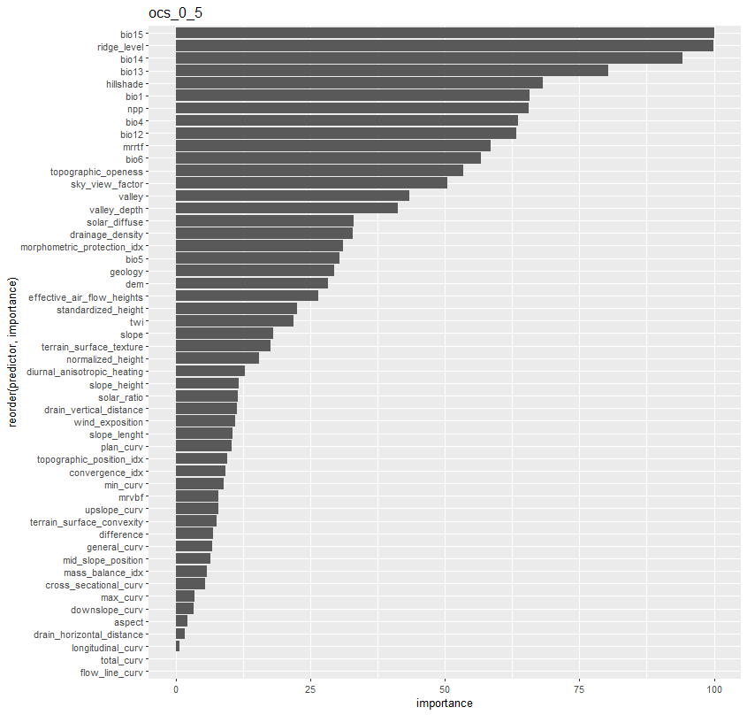
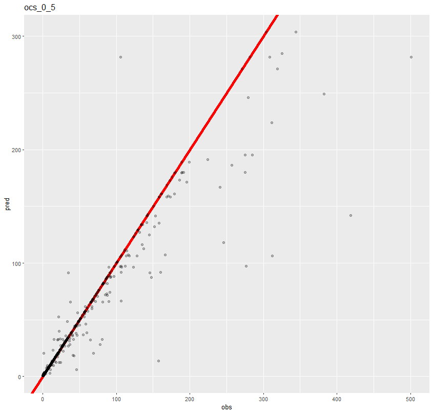

<p align="center">

</p>

# ML Model Tuning for Soil Carbon Stocks in Antarctica
## Loading Packages
```{r message=FALSE, warning=FALSE}
pkg <- c("hydroGOF", "caret", "rgdal", "beepr", "sf", "fasterize", "stringr", 
         "geobr", "readxl", "dplyr", "tmap", "tmaptools", "terra", "parallelly", 
         "gbm", "parallel", "doParallel", "DescTools", "Cubist", "kknn", 
         "kernlab", "tidyr", "RColorBrewer", "mpspline2", "earth")

sapply(pkg, require, character.only = T)
```

## Memory Cleanup
```{r message=FALSE, warning=FALSE}
rm(list = ls())  # Removes all objects from memory
gc()             # Runs garbage collection to free up memory
```

## Initial Setup
## Imports a custom function from a GitHub repository
```{r message=FALSE, warning=FALSE}
rm(list = ls())  # Removes all objects from memory
gc()             # Runs garbage collection to free up memory
```

## Parameter Definition
```{r message=FALSE, warning=FALSE}
# Control parameters for execution and models
fold_rfe <- 10              # Number of folds for cross-validation in RFE
rep_rfe <- 3                # Number of repetitions in RFE
metric_otm <- "MAE"         # Metric used to evaluate models
size_rfe <- seq(2, 60, 1)   # Sequence size for variable selection in RFE
tn_length_rfe <- 4          # Grid size for hyperparameters in RFE
tn_length <- 10             # Grid size for hyperparameters in the model
fold_model <- 10            # Number of folds for the final model training
rep_model <- 10             # Number of repetitions for the final model training
models <- c("qrf")          # Models to be adjusted (here only Quantile Random Forest)
tolerance <- FALSE          # Control to apply tolerance in variable selection
tol_per <- 2                # Tolerance percentage in variable selection


```


## Loading Data and Variables
```{r message=FALSE, warning=FALSE}
# Loads dependent variables from the input file
varsy <- read.csv2("../datasets/ocs_yx.csv") %>% 
  names() %>% 
  .[1:3]  # Selects the first 3 variables

# Defines categorical variables that need special handling
varfact <- c("curvature_classification",
             "geology",
             "geomorphons",
             "hill_idx",
             "hillslope_idx",
             "landforms_tpi_based",
             "surface_specific_points",
             "terrain_surface_classification_iwahashi",
             "valley_idx") %>% sort()


```


## Parallelism Setup
```{r message=FALSE, warning=FALSE}
# Configures the cluster for parallel execution
cl <- parallel::makeCluster(15)                  # Creates a cluster with 15 cores
cl <- parallelly::autoStopCluster(cl)            # Ensures the cluster is automatically stopped


```

## Main Structure: Iterating Over Models and Variables
```{r eval=FALSE, message=FALSE, warning=FALSE, include=TRUE}
# Outer loop to iterate over each model
for (i in seq_along(models)) {
  
  tmodel <- Sys.time() # Records the start time for the model execution
  
  
  
  
  
  # Inner loop to iterate over each dependent variable
  for (j in seq_along(varsy)) {
    
    path_results <- "../results_ocs/" # Directory to save results
    
    tvar <- Sys.time() # Records the start time for the variable execution
    
    # Loads the base dataset
    dfbase <- read.csv2("../datasets/ocs_yx.csv")
    
    # Initializes an empty data frame to save performance metrics
    dfperf <- data.frame(model = integer(1),
                         var = integer(1),
                         n = integer(1),
                         MAE_full = integer(1),
                         RMSE_full = integer(1),
                         NSE_full = integer(1),
                         PBIAS_full = integer(1),
                         aPBIAS_full = integer(1),
                         Rsquared_full = integer(1),
                         CCC_full = integer(1),
                         MAE_null_full = integer(1),
                         RMSE_null_full = integer(1))
    
    
    
    
    
    
    
    # Preparation and Directory Creation
    var <- varsy[j] # Sets the current variable
    
    
    # Creates directories to save the results
    if (!dir.exists(paste0(path_results, models[i]))) {
      dir.create(paste0(path_results, models[i]), recursive = T)
    }
    
    
    if (!dir.exists(paste0(path_results, models[i], "/", var))) {
      dir.create(paste0(path_results, models[i], "/", var))
    }
    
    
    
    path_results <- paste0(path_results, models[i], "/", var, "/")
    
    
    if (!dir.exists(paste0(path_results, "select"))) {
      dir.create(paste0(path_results, "select"))
    }
    
    if (!dir.exists(paste0(path_results, "select/cor"))) {
      dir.create(paste0(path_results, "select/cor"))
    }
    
    if (!dir.exists(paste0(path_results, "select/rfe"))) {
      dir.create(paste0(path_results, "select/rfe"))
    }
    
    if (!dir.exists(paste0(path_results, "select/rfe/metric"))) {
      dir.create(paste0(path_results, "select/rfe/metric"))
    }
    
    if (!dir.exists(paste0(path_results, "select/rfe/select"))) {
      dir.create(paste0(path_results, "select/rfe/select"))
    }
    
    if (!dir.exists(paste0(path_results, "select/rfe/metric/", var))) {
      dir.create(paste0(path_results, "select/rfe/metric/", var))
    }
    
    if (!dir.exists(paste0(path_results, "select/rfe/select/", var))) {
      dir.create(paste0(path_results, "select/rfe/select/", var))
    }
    
    if (!dir.exists(paste0(path_results, "performance"))) {
      dir.create(paste0(path_results, "performance"))
    }
    
    if (!dir.exists(paste0(path_results, "performance/csv"))) {
      dir.create(paste0(path_results, "performance/csv"))
    }
    
    if (!dir.exists(paste0(path_results, "performance/imp_pred"))) {
      dir.create(paste0(path_results, "performance/imp_pred"))
    }
    
    if (!dir.exists(paste0(path_results, "performance/imp_pred/", var))) {
      dir.create(paste0(path_results, "performance/imp_pred/", var))
    }
    
    if (!dir.exists(paste0(path_results, "img"))) {
      dir.create(paste0(path_results, "img"))
    }
    
    
    
    
    
    
    # Data Preprocessing
    dy <- dfbase %>% dplyr::select({var})  # Selects the dependent variable
    dx <- dfbase %>% dplyr::select(-{varsy})  # Excludes the remaining dependent variables
    
    # Combines the dependent and independent variables
    dyx_sel <- cbind(dy, dx) %>% 
      filter(!!sym(var) > 0) %>%  # Removes values <= 0
      na.omit() %>%               # Removes rows with missing values
      mutate_at(vars(contains(varfact)), as.factor)  # Converts categorical variables
    
    # Removes variables with low variance
    dyx_sel <- dyx_sel %>% 
      dplyr::select(-one_of(nearZeroVar(., names = T)))
    
    
    
    
    
    
    # Correlation and Feature Selection
    
    # Calculates the correlation matrix and removes highly correlated variables
    
    mcor <- dyx_sel %>%
      dplyr::select(-one_of(var)) %>%  # Exclude the target variable
      dplyr::select(-contains(c("bio", "npp"))) %>%  # Exclude specific features containing "bio" or "npp"
      dplyr::select_if(is.numeric) %>%  # Select only numeric variables
      cor(method = "spearman")  # Compute Spearman correlation
    
    fc <- findCorrelation(mcor, cutoff = 0.95, names = T)  # Identify features with high correlation (>95%)
    
    # Save correlated features to a CSV file
    data.frame(fc) %>% 
      `colnames<-`(paste0("rem_cor_", var)) %>% 
      write.csv2(file = paste0(path_results, "select/cor/", var, "_cor", ".csv"), row.names = F)
    
    # Remove highly correlated features from the dataset
    dyx_sel <- dyx_sel %>% dplyr::select(-one_of(fc))
    
    
    # Random Seed and Execution Status
    nseed <- 666  # Set a fixed random seed for reproducibility
    
    trun <- Sys.time()  # Record the start time of the process
    
    status_run <- paste(trun, models[i], var, "run")  # Create a status message
    write.table(x = status_run, file = paste0(path_raiz, "status_run.txt"), col.names = F, row.names = F)  
    print(status_run)  # Log the status message
    set.seed(nseed)  # Set the random seed for reproducibility
    
    
    
    
    
    
    
    
    
    
    # Recursive Feature Elimination (RFE) Setup
    registerDoParallel(cl)  # Register parallel processing
    set.seed(nseed)
    
    # Define control parameters for RFE
    rfe_ctrl <- rfeControl(method = "repeatedcv", 
                           repeats = rep_rfe,
                           number = fold_rfe,
                           verbose = F)
    
    # Define control parameters for the training process during RFE
    model_ctrl <- trainControl(method = "repeatedcv", 
                               number = fold_rfe,
                               repeats = rep_rfe)
    formu <- as.formula(paste(var, "~ ."))  # Define the formula for the model
    
    
    # Running RFE
    set.seed(nseed)
    rfe_fit <- rfe(form = formu,
                   data = dyx_sel,
                   sizes = size_rfe,  # Variable subset sizes to evaluate
                   method = if (models[i] %in% c("gbm_custom")) {
                     get(models[i])  # Use a custom model if specified
                   } else {
                     models[i]
                   },
                   metric = metric_otm,  # Evaluation metric
                   trControl = model_ctrl,
                   tuneLength = tn_length_rfe,
                   rfeControl = rfe_ctrl,
                   maximize = ifelse(metric_otm %in% c("RMSE", "MAE"), FALSE, TRUE))
    
    # Log and Save RFE Results
    print(rfe_fit)
    status_rfe <- paste("RFE run", models[i], var,
                        round(Sys.time() - trun, 2),
                        units(Sys.time() - trun))  # Log RFE completion time
    
    write.table(x = status_rfe, file = paste0(path_raiz, "status_rfe.txt"), col.names = F, row.names = F)
    print(status_rfe)
    
    lrferes <- rfe_fit$result  # Store RFE results
    
    
    # Tolerance-Based Feature Selection
    f (tolerance == TRUE) {
      pick <- caret::pickSizeTolerance(x = lrferes,
                                       metric = metric_otm,
                                       tol = tol_per,
                                       maximize = ifelse(metric_otm %in% c("RMSE", "MAE"), FALSE, TRUE))
      lrfepred <- rfe_fit$optVariables[1:pick]  # Select variables within tolerance
      print(paste("select", pick))
    } else {
      lrfepred <- rfe_fit$optVariables  # Select the optimal variables
      print(paste("select", length(lrfepred)))
    }
    
    
    
    
    
    # Refine Variable Selection
    if (grepl(x = paste(lrfepred, collapse = " "), pattern = paste(varfact, collapse = "|"))) {
      for (h in seq_along(varfact)) {
        cf <- data.frame(vsel_rfe = lrfepred) %>% 
          mutate(vsel_rfe = str_replace(vsel_rfe, paste0(".*", varfact[h], ".*"), varfact[h])) %>% 
          filter(!str_detect(vsel_rfe, paste(varfact[-h], collapse = "|"))) %>% 
          unique() %>% 
          pull()
        if (h == 1) {
          cff <- cf
        } else {
          cff <- c(cff, cf)
        }
      }
      lrfepred <- unique(cff)  # Update the selected variables
    }
    
    # Save RFE Results
    write.csv2(data.frame(lrferes),
               file = paste0(path_results, "select/rfe/metric/", var,
                             "/RFE_", "R2_MAE_RMSE", ".csv"), row.names = F)
    
    write.csv2(data.frame(pred_sel = lrfepred),
               file = paste0(path_results, "select/rfe/select/", var,
                             "/RFE_", "pred_sel", ".csv"), row.names = F)
    
    
    
    
    
    
    
    
    
    
    # Model Training
    # Dataset Preparation for Model Training
    dfselrfe <- dyx_sel %>% dplyr::select({var}, one_of(lrfepred))
    
    
    # Model Training Control
    set.seed(nseed)
    model_ctrl <- trainControl(
      method = "repeatedcv",       # Use repeated cross-validation
      number = fold_model,         # Number of folds
      savePredictions = T,         # Save predictions for evaluation
      repeats = rep_model          # Number of repetitions for cross-validation
    )
    # Model Formula and Training
    formu <- as.formula(paste(var, "~ ."))  # Create a formula for the model
    
    registerDoParallel(cl)  # Register parallel processing
    set.seed(nseed)
    
    model_fit <- train(
      form = formu,                # Model formula
      data = dfselrfe,             # Training data
      metric = metric_otm,         # Evaluation metric (e.g., MAE)
      method = if (models[i] %in% c("gbm_custom")) {
        get(models[i])             # Use custom model function if specified
      } else {
        models[i]
      },
      trControl = model_ctrl,      # Training control parameters
      tuneLength = tn_length,      # Length of tuning grid
      maximize = ifelse(
        metric_otm %in% c("RMSE", "MAE"), FALSE, TRUE  # Minimize error metrics
      )
    )
    
    
    # Logging Model Training Status
    print(model_fit)  # Display the model details
    status_model <- paste(
      model_fit[["modelInfo"]][["label"]], var,
      round(Sys.time() - trun, 2),
      units(Sys.time() - trun)
    )
    write.table(
      x = status_model,
      file = paste0(path_raiz, "status_model.txt"),
      col.names = F, row.names = F
    )
    print(status_model)  # Log the training status
    
    # Assign the trained model to a variable
    lmodel <- model_fit
    
    # Compute performance metrics (RMSE, MAE, R²)
    pr_full <- getTrainPerf(lmodel)
    
    # Compute the Concordance Correlation Coefficient (CCC)
    ccc_full <- CCC(
      dfselrfe[, var], predict(lmodel, dfselrfe),
      conf.level = 0.95
    )
    
    # Compute metrics for the null model (predicting the mean)
    pr_null_full <- rep(mean(dfselrfe[, var]), nrow(dfselrfe)) %>%
      postResample(pred = ., obs = dfselrfe[, var])
    
    # Compute the NSE (Nash-Sutcliffe Efficiency)
    nse_full <- NSE(
      sim = as.data.frame(predict(lmodel, dfselrfe)),
      obs = dfselrfe[, var], na.rm = T
    )
    
    # Compute PBIAS (Percent Bias)
    pbias_full <- pbias(
      sim = as.data.frame(predict(lmodel, dfselrfe)),
      obs = dfselrfe[, var], na.rm = T
    )
    
    # Compute Absolute PBIAS
    apbias_full <- abs(pbias_full)
    
    # Compute variable importance
    pred_imp <- varImp(lmodel)
    
    # Process the importance results
    lpredimp <- data.frame(pred_imp[1]) %>%
      mutate(
        predictor = row.names(.),
        importance = Overall
      ) %>%
      dplyr::select(-Overall) %>%
      relocate(predictor)
    
    # Generate the variable importance plot
    g1 <- ggplot(lpredimp, aes(y = reorder(predictor, importance), x = importance)) +
      geom_col() +
      labs(title = var)
    plot(g1)
    
    # Pause to ensure rendering
    Sys.sleep(2)
    
    # Prepare data for the prediction vs. observation plot
    df_po <- data.frame(
      obs = dfselrfe[, var],       # Observed values
      pred = predict(lmodel, dfselrfe)  # Predicted values
    )
    
    # Generate the prediction vs. observation plot
    g2 <- ggplot(df_po, aes(y = pred, x = obs)) +
      geom_abline(col = "red", lwd = 2) +  # Reference line
      geom_point(alpha = 0.25) +          # Scatter points
      labs(title = var)
    plot(g2)
    
    # Save variable importance to a CSV file
    write.csv2(
      lpredimp,
      paste0(path_results, "performance/imp_pred/", var, "/", "imp_pred", ".csv"),
      row.names = F
    )
    
    # Save performance metrics to a data frame
    dfperf$model[1] <- lmodel[["modelInfo"]][["label"]]
    dfperf$var[1] <- var
    dfperf$n[1] <- nrow(dfselrfe)
    dfperf$MAE_full[1] <- pr_full$TrainMAE
    dfperf$RMSE_full[1] <- pr_full$TrainRMSE
    dfperf$Rsquared_full[1] <- pr_full$TrainRsquared
    dfperf$MAE_null_full[1] <- pr_null_full["MAE"]
    dfperf$RMSE_null_full[1] <- pr_null_full["RMSE"]
    dfperf$CCC_full[1] <- ccc_full$rho.c$est
    dfperf$NSE_full[1] <- nse_full
    dfperf$PBIAS_full[1] <- pbias_full
    dfperf$aPBIAS_full[1] <- apbias_full
    
    # Save the performance data frame to a CSV file
    write.csv2(
      dfperf,
      row.names = F,
      paste0(path_results, "performance/csv/", var, "_performance", ".csv")
    )
    
    # Save the current environment to an RData file
    save.image(paste0(path_results, "img/", var, ".RData"))
    
    # Run garbage collection to free up memory
    gc()
  }
  
  
  
  
  
  status_var <- paste(
    model_fit[["modelInfo"]][["label"]],  # Model name or label
    var,                                  # Current variable being processed
    round(Sys.time() - tvar, 2),          # Total time taken for processing the variable
    units(Sys.time() - tvar)              # Units of the elapsed time (e.g., seconds, minutes)
  )
  
  # Save the status of the variable processing to a text file
  write.table(
    x = status_var,
    file = paste0(path_raiz, "status_var.txt"),  # File path for saving the status
    col.names = F, row.names = F                # No column or row names in the output
  )
  
  # Print the status of the variable processing to the console
  print(status_var)
  
  
  
}

status_model_full <- paste(
  model_fit[["modelInfo"]][["label"]],        # Model name or label
  round(Sys.time() - tmodel, 2),              # Total time taken for the entire model execution
  units(Sys.time() - tmodel)                  # Units of the elapsed time
)

# Save the overall model execution status to a text file
write.table(
  x = status_model_full,
  file = paste0(path_raiz, "status_model_full.txt"),  # File path for saving the status
  col.names = F, row.names = F                        # No column or row names in the output
)

# Print the overall model execution status to the console
print(status_model_full)


```
<p align="center">

</p>


<p align="center">

</p>


