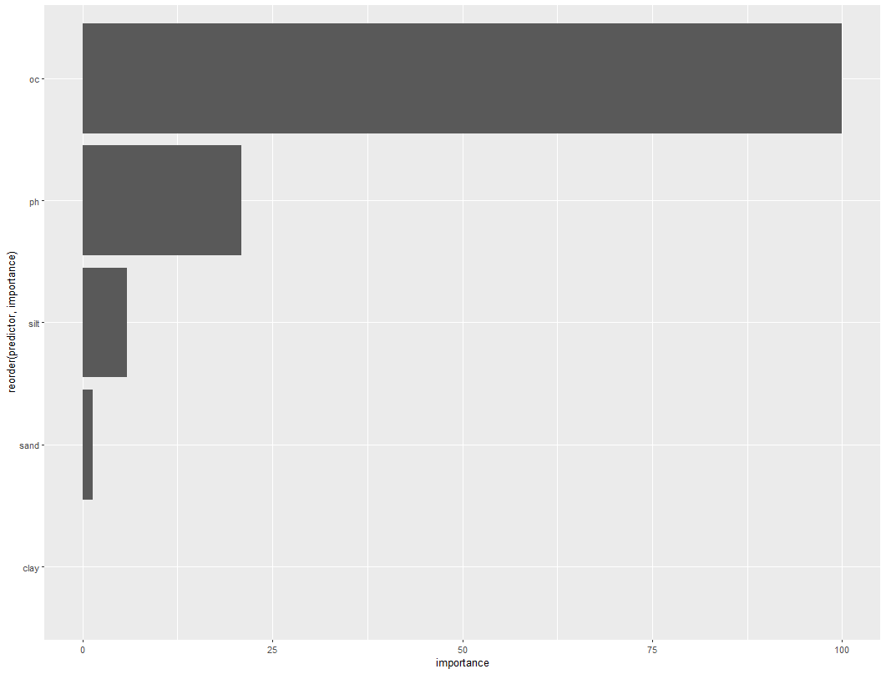
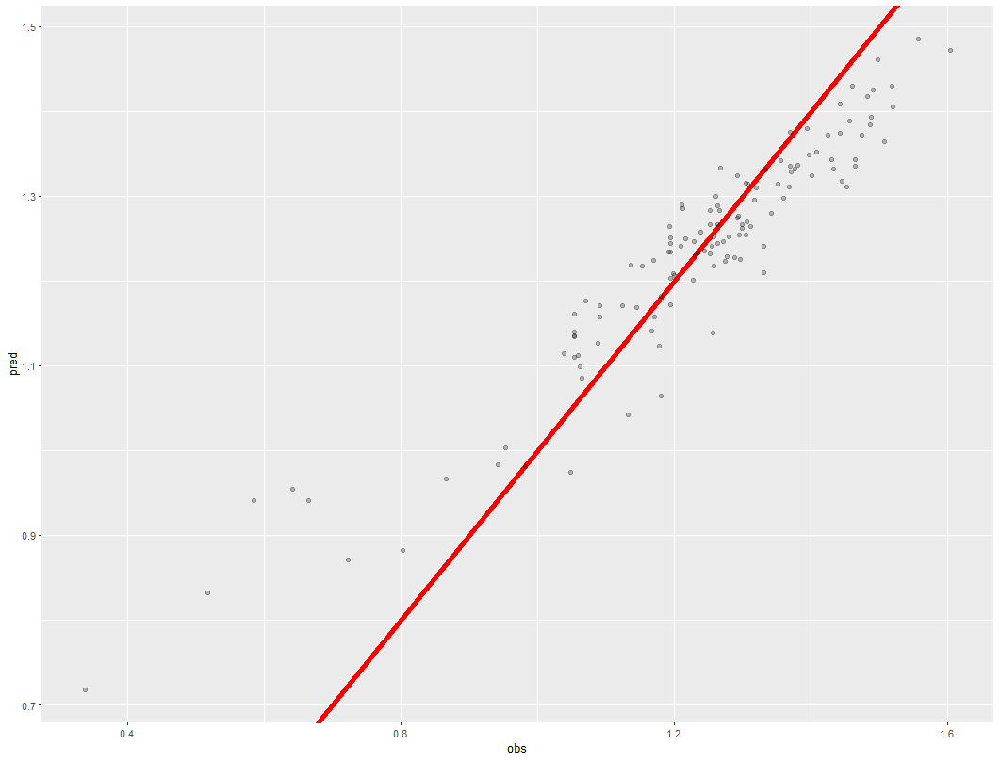

# Load Required Packages
```{r message=FALSE, warning=FALSE}
pkg <- c("hydroGOF", "caret", "rgdal", "beepr", "sf", "fasterize", "stringr",
         "geobr", "readxl", "dplyr", "tmap", "tmaptools", "terra", "parallelly",
         "gbm", "parallel", "doParallel", "DescTools", "Cubist", "kknn",
         "kernlab", "tidyr", "RColorBrewer", "mpspline2", "earth", "readr")

# Load each package listed. If a package is not installed, it must be installed beforehand.
sapply(pkg, require, character.only = T)
```
# Clean Environment and Memory
```{r}
rm(list = ls())  # Remove all objects from the global environment
gc()             # Force garbage collection to optimize memory usage
```


# Define Paths and Load Custom Functions
```{r message=FALSE, warning=FALSE}
# Set the main processing directory
path_raiz <- "C:/usuario_processamento/cassio/R/soc_stock_antarctica/"
setwd(path_raiz)  # Change the working directory to the specified path

# Load custom functions for use in the models
source("https://github.com/moquedace/funcs/blob/main/gbm_custom.R?raw=TRUE")

# Define the dependent variable for analysis
varsy <- c("bd")  # For example, "bd" might represent soil bulk density

# Metric used to optimize the models (Mean Absolute Error)
metric_otm <- "MAE"

# Number of parameters to be tuned during training
tn_length <- 1

# List of machine learning models to be tested
models <- c("rf", "svmRadial", "cubist", "kknn")

# Categorical variables that need to be treated as factors
varfact <- c("curvature_classification") %>% sort()

# Configure the cluster for parallelization
cl <- parallel::makeCluster(20)  # Create a cluster with 20 cores for parallel processing
cl <- parallelly::autoStopCluster(cl)  # Set the cluster to stop automatically after execution

```

# Model Training Loop
```{r eval=FALSE, message=FALSE, warning=FALSE, include=TRUE}
# Loop through each model listed
for (i in seq_along(models)) {
  
  tmodel <- Sys.time()  # Record the start time for the current model's training
  
  # Inner loop for each dependent variable
  for (j in seq_along(varsy)) {
    
    path_results <- "./results_bd/"  # Define the base path to save results
    
    tvar <- Sys.time()  # Record the start time for the current variable
    
    # Load the main dataset and remove irrelevant columns
    dfbase <- read_csv2("./datasets/dataset_soc_stock_antarctica.csv") %>% 
      select(-soil, -prof_super, -prof_infer, -crs_name, -crs_code, -X, -Y)
    
    var <- varsy[j]  # Set the current variable under analysis
    
    # Create directories to save results if they do not already exist
    if (!dir.exists(paste0(path_results, models[i]))) {
      dir.create(paste0(path_results, models[i]), recursive = T)
    }
    if (!dir.exists(paste0(path_results, models[i], "/", var))) {
      dir.create(paste0(path_results, models[i], "/", var))
    }
    # Continue creating subdirectories for different types of results (selection, metrics, etc.)
    if (!dir.exists(paste0(path_results, "performance"))) {
      dir.create(paste0(path_results, "performance"))
    }
    
    
    
    
    
    
    
    
    
    
    # Data pre-processing
    dy <- dfbase %>% dplyr::select({var})  # Select the target variable
    dx <- dfbase %>% dplyr::select(-{varsy})  # Select all other variables as predictors
    
    # Filter the data, removing missing and negative values
    dyx_sel <- cbind(dy, dx) %>%
      filter(!!sym(var) >= 0) %>%
      na.omit()
    
    # Convert categorical variables to factors
    dyx_sel <- dyx_sel %>%
      mutate_at(.vars = vars(contains(varfact)), as.factor)
    
    # Remove variables with low variance to optimize the model
    dyx_sel <- dyx_sel %>%
      dplyr::select(-one_of(nearZeroVar(., names = T)))
    
    # Compute the correlation matrix to remove highly correlated variables
    mcor <- dyx_sel %>% dplyr::select_if(is.numeric) %>%
      cor(method = "spearman")
    
    fc <- findCorrelation(mcor, cutoff = 0.95, names = T)  # Identify correlated variables
    
    # Remove variables identified as highly correlated
    dyx_sel <- dyx_sel %>% dplyr::select(-one_of(fc))
    
    
    
    
    
    
    
    
    
    
    
    
    
    
    
    
    
    
    # Define the number of samples from the pre-processed data
    n_samples <- nrow(dyx_sel)
    
    # Create an empty data frame to store training performance metrics
    dfperf_train <- data.frame(
      model = integer(n_samples),
      var = integer(n_samples),
      n_train = integer(n_samples),
      MAE_train = integer(n_samples),
      RMSE_train = integer(n_samples),
      NSE_train = integer(n_samples),
      PBIAS_train = integer(n_samples),
      aPBIAS_train = integer(n_samples),
      Rsquared_train = integer(n_samples),
      CCC_train = integer(n_samples),
      MAE_null_train = integer(n_samples),
      RMSE_null_train = integer(n_samples)
    )
    
    # Create an empty data frame to store test performance metrics
    dfperf_test <- data.frame(
      model = integer(1),
      var = integer(1),
      MAE_test = integer(1),
      RMSE_test = integer(1),
      NSE_test = integer(1),
      PBIAS_test = integer(1),
      aPBIAS_test = integer(1),
      Rsquared_test = integer(1),
      CCC_test = integer(1),
      MAE_null_test = integer(1),
      RMSE_null_test = integer(1)
    )
    
    # Create an empty data frame to store predicted and observed values
    df_test_pred_obs <- data.frame(
      pred = integer(n_samples),
      obs = integer(n_samples)
    )
    
    # Set a fixed seed for reproducibility and generate random seeds for each sample
    set.seed(666)
    nseed <- sample(1:100000, n_samples)
    
    # Initialize empty lists to store trained models, variable importance, and other data
    lmodel <- list()      # Stores trained models
    lpredimp <- list()    # Stores variable importance for each model
    lrfepred <- list()    # Stores predictions from Recursive Feature Elimination (RFE)
    lrferes <- list()     # Stores results from RFE
    ltrain <- list()      # Stores training datasets for each iteration
    ltest <- list()       # Stores test datasets for each iteration
    
    
    
    
    
    
    
    
    
    
    
    
    
    
    
    
    
    
    
    
    
    # Loop through each sample for Leave-One-Out Cross-Validation
    for (n in 1:n_samples) {
      
      trun <- Sys.time()  # Record the start time for the current iteration
      
      # Print and save the status of the current run
      status_run <- paste(trun, models[i], var, "run", n, "missing", n_samples - n)
      write.table(x = status_run, file = paste0(path_raiz, "status_run.txt"),
                  col.names = F, row.names = F)
      print(status_run)
      
      # Set the seed for reproducibility
      set.seed(nseed[n])
      
      # Split the data: one sample is held out for testing, the rest for training
      train <- dyx_sel[-n, ]  # Training data
      test <- dyx_sel[n, ]    # Test data (single observation)
      
      # Save training and test datasets in their respective lists
      ltrain[[n]] <- train
      ltest[[n]] <- test
      
      # Use the training data for feature selection (e.g., RFE)
      dfselrfe <- train
      
     
      
      
      
      
      
      
      
      
      
      
      
      
      
      
      
      
       # Configure the control parameters for training (Leave-One-Out Cross-Validation)
      set.seed(nseed[n])
      # Configuration for training the models
      formu <- as.formula(paste(var, "~ ."))  # Model formula: target variable ~ all other variables
      model_ctrl <- trainControl(method = "LOOCV")  # Leave-One-Out Cross-Validation
      # Train the model
      # Register the parallel backend using the previously created cluster (cl)
      registerDoParallel(cl)
      
      # Set the seed for reproducibility specific to the current iteration (n)
      set.seed(nseed[n])
      
      # Train the model using the specified formula, data, and parameters
      model_fit <- train(
        form = formu,                           # Model formula: target variable ~ predictors
        data = dfselrfe,                        # Training data filtered for feature selection (dfselrfe)
        metric = metric_otm,                    # Optimization metric (e.g., MAE, RMSE)
        method = if (models[i] %in% c("gbm_custom")) {  
          get(models[i])                        # Custom model method if listed (e.g., gbm_custom)
        } else {
          models[i]                             # Standard method if not custom
        },
        trControl = model_ctrl,                 # Training control parameters (e.g., LOOCV)
        tuneLength = tn_length,                 # Number of hyperparameters to tune
        # importance = T,                       # (Optional) Compute variable importance if needed
        serialize = if (models[i] %in% c("gbm_custom")) {
          TRUE                                  # Enable serialization for custom models
        } else {
          FALSE                                 # Do not serialize for standard models
        },
        maximize = ifelse(
          metric_otm %in% c("RMSE", "MAE"),     # For error metrics (e.g., RMSE, MAE), minimize
          FALSE,
          TRUE                                  # Otherwise, maximize the metric
        )
      )
      
      # Print the fitted model summary to the console
      print(model_fit)
      print("-----------------------------------------------------------------")
      
      # Construct a status message with the model details and elapsed time for this iteration
      status_model <- paste(
        model_fit[["modelInfo"]][["label"]],    # Model name/label
        var,                                   # Target variable being modeled
        n,                                     # Current iteration number
        round(Sys.time() - trun, 2),           # Elapsed time for the iteration
        units(Sys.time() - trun)               # Time units (e.g., seconds, minutes)
      )
      
      # Save the status message to a file for logging progress
      write.table(
        x = status_model,                      # Status message to write
        file = paste0(path_raiz, "status_model.txt"),  # Path to the status log file
        col.names = F,                         # Do not include column names in the output
        row.names = F                          # Do not include row names in the output
      )
      
      # Print the status message to the console for immediate feedback
      print(status_model)
      print("-----------------------------------------------------------------")
      # Save the trained model in the list
      lmodel[[n]] <- model_fit
      
      
     
      
      
      
      
      
      
      
      
      
      
      
       # Calculate training performance metrics: RMSE, MAE, and R² for the trained model
      pr_train <- getTrainPerf(lmodel[[n]])
      
      # Calculate the Concordance Correlation Coefficient (CCC) for training data
      ccc_train <- CCC(train[, var], predict(lmodel[[n]], train),
                       conf.level = 0.95)
      
      # Calculate null model performance metrics (baseline predictions as the mean of observed values)
      pr_null_train = rep(mean(train[, var]), nrow(train)) %>%
        postResample(pred = ., obs = train[, var])
      
      # Calculate Nash-Sutcliffe Efficiency (NSE) for the training data
      nse_train <- NSE(sim = as.data.frame(predict(lmodel[[n]], train)),
                       obs = train[, var], na.rm = T)
      
      # Calculate Percentage Bias (PBIAS) for training predictions
      pbias_train <- pbias(sim = as.data.frame(predict(lmodel[[n]], train)),
                           obs = train[, var], na.rm = T)
      
      # Calculate Absolute Percentage Bias (aPBIAS) as the absolute value of PBIAS
      apbias_train <- pbias(sim = as.data.frame(predict(lmodel[[n]], train)),
                            obs = train[, var], na.rm = T) %>% abs()
      
      # Store observed and predicted values for the current test sample
      df_test_pred_obs$obs[n] <- test[, var]
      df_test_pred_obs$pred[n] <- predict(lmodel[[n]], test)
      
      
      
      
      
      
      
      
      
      
      
      
      
      
      
      
      # Compute variable importance for the trained model
      pred_imp <- varImp(lmodel[[n]])
      
      # Format variable importance as a data frame and store it in the list
      lpredimp[[n]] <- data.frame(pred_imp[1]) %>%
        mutate(predictor = row.names(.),
               importance = Overall) %>%  # Rename importance column
        dplyr::select(-Overall) %>%      # Drop original column to avoid duplication
        relocate(predictor)              # Move predictor column to the first position
      
      # Plot a bar chart of variable importance
      g1 <- ggplot(lpredimp[[n]],
                   aes(y = reorder(predictor, importance),
                       x = importance)) +
        geom_col()
      plot(g1)  # Display the plot
      
      Sys.sleep(2)  # Pause for 2 seconds to avoid overwhelming the system with plots
      
      # Create a data frame for observed vs. predicted values (training data)
      df_po <- data.frame(obs = train[, var],
                          pred = predict(lmodel[[n]], train))
      
      # Scatter plot for observed vs. predicted values with a 1:1 reference line
      g2 <- ggplot(df_po, aes(y = pred, x = obs)) +
        geom_abline(col = "red", lwd = 2) +  # 1:1 line in red
        geom_point(alpha = 0.25)             # Points with transparency
      plot(g2)  # Display the plot
      
      # Save variable importance results to a CSV file
      write.csv2(lpredimp[[n]],
                 paste0(path_results, "performance/imp_pred/", var, "/",
                        "imp_pred_", n, ".csv"), row.names = F)
      
     
      
      
      
      
      
      
      
      
      
      
      
      
      
      
       # Store training performance metrics for the current iteration
      dfperf_train$model[n] <- lmodel[[n]][["modelInfo"]][["label"]]  # Model name
      dfperf_train$var[n] <- var                                     # Target variable
      dfperf_train$n_train[n] <- nrow(train)                        # Number of training samples
      dfperf_train$MAE_train[n] <- pr_train$TrainMAE               # Training MAE
      dfperf_train$RMSE_train[n] <- pr_train$TrainRMSE             # Training RMSE
      dfperf_train$Rsquared_train[n] <- pr_train$TrainRsquared     # Training R²
      dfperf_train$MAE_null_train[n] <- pr_null_train["MAE"]       # Null model MAE
      dfperf_train$RMSE_null_train[n] <- pr_null_train["RMSE"]     # Null model RMSE
      dfperf_train$CCC_train[n] <- ccc_train$rho.c$est             # Training CCC
      dfperf_train$NSE_train[n] <- nse_train                       # Training NSE
      dfperf_train$PBIAS_train[n] <- pbias_train                   # Training PBIAS
      dfperf_train$aPBIAS_train[n] <- apbias_train                 # Training absolute PBIAS
      
     
      
      
      
      
      
      
      
      
      
       # Save training performance metrics to a CSV file
      write.csv2(dfperf_train, row.names = F, paste0(
        path_results, "performance/csv/", var, "_performance_train", ".csv"))
      
      # Save the current environment state for reproducibility
      save.image(paste0(path_results, "img/", var, ".RData"))
      
      # Trigger garbage collection to free memory
      gc()
    }
   
    
    
    
    
    
    
    
    
    
    
    
    
    
     # Testing phase --------------------------------------------------------------
    
    # Calculate performance metrics for the test set (RMSE, MAE, R²)
    pr_test <- postResample(pred = df_test_pred_obs[, "pred"],
                            obs = df_test_pred_obs[, "obs"])
    
    # Calculate CCC for the test set
    ccc_test <- CCC(df_test_pred_obs[, "obs"], df_test_pred_obs[, "pred"],
                    conf.level = 0.95)
    
    # Calculate null model performance metrics for the test set
    pr_null_test = rep(mean(df_test_pred_obs[, "obs"]), nrow(df_test_pred_obs)) %>%
      postResample(pred = ., obs = df_test_pred_obs[, "obs"])
    
    # Calculate NSE for the test set
    nse_test <- NSE(sim = df_test_pred_obs[, "pred"],
                    obs = df_test_pred_obs[, "obs"], na.rm = T)
    
    # Calculate PBIAS for the test set
    pbias_test <- pbias(sim = df_test_pred_obs[, "pred"],
                        obs = df_test_pred_obs[, "obs"], na.rm = T)
    
    # Calculate absolute PBIAS for the test set
    apbias_test <- pbias(sim = df_test_pred_obs[, "pred"],
                         obs = df_test_pred_obs[, "obs"], na.rm = T) %>% abs()
    
    # Store test performance metrics
    dfperf_test$model <- lmodel[[n]][["modelInfo"]][["label"]]
    dfperf_test$var <- var
    dfperf_test$MAE_test <- pr_test["MAE"]
    dfperf_test$RMSE_test <- pr_test["RMSE"]
    dfperf_test$Rsquared_test <- pr_test["Rsquared"]
    dfperf_test$MAE_null_test <- pr_null_test["MAE"]
    dfperf_test$RMSE_null_test <- pr_null_test["RMSE"]
    dfperf_test$CCC_test <- ccc_test$rho.c$est
    dfperf_test$NSE_test <- nse_test
    dfperf_test$PBIAS_test <- pbias_test
    dfperf_test$aPBIAS_test <- apbias_test
    
    # Save test performance metrics to a CSV file
    write.csv2(dfperf_test, row.names = F, paste0(
      path_results, "performance/csv/", var, "_performance_test", ".csv"))
    
    # Log the status of the variable's processing
    status_var <- paste(model_fit[["modelInfo"]][["label"]], var,
                        round(Sys.time() - tvar, 2),
                        units(Sys.time() - tvar))
    write.table(x = status_var, file = paste0(path_raiz, "status_var.txt"),
                col.names = F, row.names = F)
    print(status_var)
    
    
  }
  
 
  
  
  
  
  
  
  
  
  
  
   # Construct a status message for the entire model's processing time
  status_model_full <- paste(
    model_fit[["modelInfo"]][["label"]],          # Retrieve the model's label (e.g., "Random Forest", "SVM")
    round(Sys.time() - tmodel, 2),                # Calculate and round the total processing time for the model
    units(Sys.time() - tmodel)                    # Append the units of time (e.g., "secs", "mins")
  )
  
  # Save the status message to a text file for tracking the model's execution time
  write.table(
    x = status_model_full,                        # The status message to write
    file = paste0(path_raiz, "status_model_full.txt"),  # File path for the output
    col.names = F,                                # Do not include column names in the output
    row.names = F                                 # Do not include row names in the output
  )
  
  # Print the status message to the console for immediate feedback during execution
  print(status_model_full)
  
}

```
<p align="center">

</p>


<p align="center">

</p>


