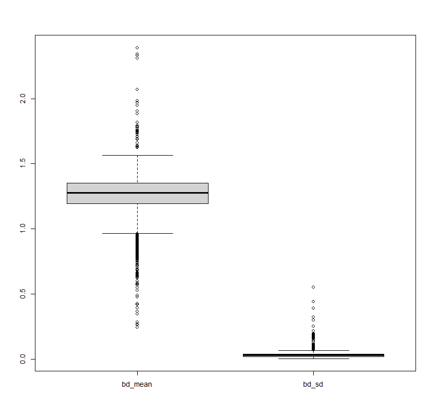
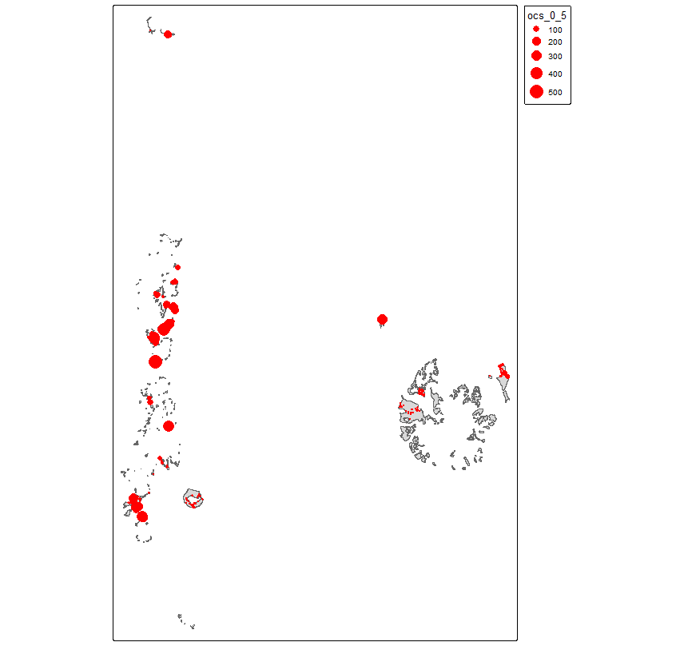

<p align="center">

</p>

# Soil Bulk Density Prediction and Carbon Stock Spline
## Initial Setup
```{r message=FALSE, warning=FALSE}
# List of required packages
pkg <- c("dplyr", "caret", "randomForest", "e1071", "ggplot2", "doParallel",
         "tidyr", "stringr", "parallelly", "quantregForest", "parallel",
         "terra", "data.table", "readr", "sf", "tmap")

## Load each package listed, installing if necessary
sapply(pkg, require, character.only = TRUE)

## Clear the global environment
rm(list = ls())

```


## Data Loading and Preprocessing
```{r message=FALSE, warning=FALSE}
# Identify the first .RData file containing "bd"
lvar <- list.files(path = "../results_bd", pattern = ".RData$",
                   full.names = TRUE, recursive = TRUE) %>% 
  grep(pattern = "bd", value = TRUE) %>% 
  .[1]

# Load the soil properties dataset and select relevant columns
df_sp <- read_csv2("../datasets/dataset_soc_stock_antarctica.csv") %>% 
  select(soil, prof_super, prof_infer, bd, oc, ph, clay, sand, silt, X, Y)

head(df_sp)
#> # A tibble: 6 × 11
#>   soil  prof_super prof_infer    bd    oc    ph  clay  sand  silt       X      Y
#>   <chr>      <dbl>      <dbl> <dbl> <dbl> <dbl> <dbl> <dbl> <dbl>   <dbl>  <dbl>
#> 1 Arct…          0         15    NA  4.87  5.54  0     95.9  4.09 -2.70e6 1.66e6
#> 2 Arct…          0         15    NA  8.1   5.7   0     96.6  3.38 -2.70e6 1.66e6
#> 3 Arct…          0         15    NA  3.74  5.84  0.29  90    9.71 -2.70e6 1.66e6
#> 4 Arct…          0         15    NA  0.63  6.55  3.13  62.4 34.4  -2.70e6 1.66e6
#> 5 Arct…          0         15    NA  4.92  5.47  0.05  91.7  8.27 -2.70e6 1.66e6
#> 6 Arct…          0         15    NA  2.03  6.19  0.64  85.7 13.7  -2.70e6 1.66e6


# Remove rows with missing 'bd' values and add a unique ID column
df_cp <- df_sp %>% 
  drop_na(!bd) %>% 
  mutate(id = 1:nrow(.))

head(df_cp)
#> # A tibble: 6 × 12
#>   soil  prof_super prof_infer    bd    oc    ph  clay  sand  silt       X      Y
#>   <chr>      <dbl>      <dbl> <dbl> <dbl> <dbl> <dbl> <dbl> <dbl>   <dbl>  <dbl>
#> 1 Arct…          0         15    NA  4.87  5.54  0     95.9  4.09 -2.70e6 1.66e6
#> 2 Arct…          0         15    NA  8.1   5.7   0     96.6  3.38 -2.70e6 1.66e6
#> 3 Arct…          0         15    NA  3.74  5.84  0.29  90    9.71 -2.70e6 1.66e6
#> 4 Arct…          0         15    NA  0.63  6.55  3.13  62.4 34.4  -2.70e6 1.66e6
#> 5 Arct…          0         15    NA  4.92  5.47  0.05  91.7  8.27 -2.70e6 1.66e6
#> 6 Arct…          0         15    NA  2.03  6.19  0.64  85.7 13.7  -2.70e6 1.66e6
#> # ℹ 1 more variable: id <int>

```


## Model Execution and Predictions
```{r message=FALSE, warning=FALSE}
# Mark the start of total execution time
t1 <- Sys.time()

# Load the selected .RData file
load(lvar)

# Iterate over models in the 'lmodel' list
for (k in seq_along(lmodel)) {
  t2 <- Sys.time()  # Start time for the current model
  
  # Predict 'bd' values using the current model
  df_pred <- data.frame(select(df_cp, id),
                        bd = predict(lmodel[[k]], df_cp))
  
  # Combine predictions into a single data frame
  if (k == 1) {
    df_pred_final <- df_pred
  } else {
    df_pred_final <- rbind(df_pred_final, df_pred)
  }
  
  # Display model progress
  print(paste(var, "model", k, round(Sys.time() - t2, 2),
              units(Sys.time() - t2)))
}

# Free up memory
gc()

# Display the total execution time
print(paste("full", var, round(Sys.time() - t1, 2), units(Sys.time() - t1)))

head(df_pred_final)
#>   id       bd
#> 1  1 1.198419
#> 2  2 1.142646
#> 3  3 1.285930
#> 4  4 1.319469
#> 5  5 1.220455
#> 6  6 1.338670

```

## Statistical Analysis of Predictions
```{r message=FALSE, warning=FALSE}
# Calculate statistics by ID: mean, standard deviation, and coefficient of variation
df_pred_summary <- df_pred_final %>%
  group_by(id) %>% 
  summarise(bd_mean = mean(bd),
            bd_sd = sd(bd)) %>% 
  mutate(cv = bd_sd / bd_mean * 100)

# Display the first rows of the summary
head(df_pred_summary)
#> # A tibble: 6 × 4
#>      id bd_mean  bd_sd    cv
#>   <int>   <dbl>  <dbl> <dbl>
#> 1     1    1.20 0.0369  3.08
#> 2     2    1.14 0.0472  4.14
#> 3     3    1.28 0.0454  3.56
#> 4     4    1.32 0.0262  1.98
#> 5     5    1.21 0.0267  2.19
#> 6     6    1.33 0.0346  2.61

# Create a boxplot with the results
boxplot(df_pred_summary[, c("bd_mean", "bd_sd")])

# Calculate the mean predictions for each ID
df_pred_mean <- df_pred_final %>%
  group_by(id) %>% 
  summarise(bd_pred = mean(bd))


head(df_pred_mean)
head(df_pred_mean)
#> # A tibble: 6 × 2
#>      id bd_pred
#>   <int>   <dbl>
#> 1     1    1.20
#> 2     2    1.14
#> 3     3    1.28
#> 4     4    1.32
#> 5     5    1.21
#> 6     6    1.33

```
<p align="center">

</p>

## Graphical Visualization of Predictions
```{r message=FALSE, warning=FALSE}
# Violin plot for prediction visualization
ggplot(df_pred_mean, aes(y = bd_pred, x = 0)) +
  geom_violin() +
  geom_jitter(width = 0.05, alpha = 0.03) +
  geom_boxplot(width = 0.1, fill = "transparent", col = "black", size = 1,
               outliers = FALSE) +
  labs(x = NULL, y = expression(Bulk~density~(g~cm^-3))) +
  theme(axis.text.x = element_blank(),
        axis.title = element_text(size = 20),
        axis.text = element_text(size = 20))

```
<p align="center">

</p>


## Calculation of Soil Organic Carbon Stock (SOC)
```{r message=FALSE, warning=FALSE}
# Merge predictions with original data and calculate SOC
df_cpf <- df_cp %>% 
  left_join(df_pred_mean, by = "id") %>% 
  select(-id) %>% 
  mutate(bd_full = ifelse(is.na(bd), bd_pred, bd)) %>% 
  select(-bd) %>% 
  mutate(ocs = (oc * bd_full * (prof_infer - prof_super)),
         solos = as.factor(soil))

head(df_cpf)

#> # A tibble: 6 × 14
#>   soil        prof_super prof_infer    oc    ph  clay  sand  silt       X      Y
#>   <chr>            <dbl>      <dbl> <dbl> <dbl> <dbl> <dbl> <dbl>   <dbl>  <dbl>
#> 1 ArctowskiA…          0         15  4.87  5.54  0     95.9  4.09 -2.70e6 1.66e6
#> 2 ArctowskiA…          0         15  8.1   5.7   0     96.6  3.38 -2.70e6 1.66e6
#> 3 ArctowskiA…          0         15  3.74  5.84  0.29  90    9.71 -2.70e6 1.66e6
#> 4 ArctowskiA…          0         15  0.63  6.55  3.13  62.4 34.4  -2.70e6 1.66e6
#> 5 ArctowskiA…          0         15  4.92  5.47  0.05  91.7  8.27 -2.70e6 1.66e6
#> 6 ArctowskiA…          0         15  2.03  6.19  0.64  85.7 13.7  -2.70e6 1.66e6
#> # ℹ 4 more variables: bd_pred <dbl>, bd_full <dbl>, ocs <dbl>, solos <fct>


# Get unique coordinates for each soil type
df_coords <- df_cp %>% 
  distinct(soil, .keep_all = TRUE)

head(df_coords)
#> # A tibble: 6 × 12
#>   soil  prof_super prof_infer    bd    oc    ph  clay  sand  silt       X      Y
#>   <chr>      <dbl>      <dbl> <dbl> <dbl> <dbl> <dbl> <dbl> <dbl>   <dbl>  <dbl>
#> 1 Arct…          0         15    NA  4.87  5.54  0     95.9  4.09 -2.70e6 1.66e6
#> 2 Arct…          0         15    NA  8.1   5.7   0     96.6  3.38 -2.70e6 1.66e6
#> 3 Arct…          0         15    NA  3.74  5.84  0.29  90    9.71 -2.70e6 1.66e6
#> 4 Arct…          0         15    NA  0.63  6.55  3.13  62.4 34.4  -2.70e6 1.66e6
#> 5 Arct…          0         15    NA  4.92  5.47  0.05  91.7  8.27 -2.70e6 1.66e6
#> 6 Arct…          0         15    NA  2.03  6.19  0.64  85.7 13.7  -2.70e6 1.66e6
#> # ℹ 1 more variable: id <int>


```


## Spline Interpolation for SOC
```{r message=FALSE, warning=FALSE}
# Load spline function from an external repository
source("https://github.com/moquedace/funcs/blob/main/s_fspline.R?raw=TRUE")

# Apply spline to calculate SOC at specific depths
ocs_spl <- spl(obj = df_cpf,
               id = "soil",
               upper_limit = "prof_super",
               lower_limit = "prof_infer",
               var_name = "ocs",
               lam = 0.1,
               d = c(0, 5, 15, 30),
               vlow = 0,
               vhigh = 1000)

# Format results and convert to spatial object
ocs_spl_sf <- ocs_spl %>% 
  left_join(select(df_coords, soil, X, Y), by = c("perfil" = "soil")) %>% 
  select(-perfil) %>% 
  rename(ocs_0_5 = X000_005_cm,
         ocs_5_15 = X005_015_cm,
         ocs_15_30 = X015_030_cm) %>% 
  st_as_sf(coords = c("X", "Y"), crs = "ESRI:102021")

print(ocs_spl_sf)
#> Simple feature collection with 1015 features and 3 fields
#> Geometry type: POINT
#> Dimension:     XY
#> Bounding box:  xmin: -2730323 ymin: 1492470 xmax: -2438759 ymax: 1868111
#> Projected CRS: South_Pole_Stereographic
#> First 10 features:
#>       ocs_0_5   ocs_5_15  ocs_15_30                 geometry
#> 1   87.648852  87.648852  87.648852 POINT (-2701334 1657796)
#> 2  138.480612 138.480612 138.480612 POINT (-2701095 1658023)
#> 3   71.619839  71.619839  71.619839 POINT (-2700977 1657680)
#> 4   12.511957  12.511957  12.511957 POINT (-2701133 1657364)
#> 5   89.659415  89.659415  89.659415 POINT (-2701427 1657437)
#> 6   40.429277  40.429277  40.429277 POINT (-2701265 1656508)
#> 7   16.215461  16.215461  16.215461 POINT (-2700758 1657459)
#> 8    9.358007   9.358007   9.358007 POINT (-2701892 1657560)
#> 9   91.332174  88.001281         NA POINT (-2709528 1632654)
#> 10         NA  72.899401         NA POINT (-2709517 1632692)


```


## Spatial Visualization and Export
```{r message=FALSE, warning=FALSE}
# Load and validate a reference shapefile
ifa <- st_read("../data/aifa.shp") %>% 
  st_make_valid()
#> Reading layer `aifa' from data source 
#>   `C:\usuario_processamento\cassio\R\soc_stock_antarctica\data\aifa.shp' 
#>   using driver `ESRI Shapefile'
#> Simple feature collection with 303 features and 6 fields
#> Geometry type: MULTIPOLYGON
#> Dimension:     XY, XYZ
#> Bounding box:  xmin: -2735931 ymin: 1409143 xmax: -2437432 ymax: 1878264
#> z_range:       zmin: 0 zmax: 0
#> Projected CRS: South_Pole_Stereographic


# Interactive visualization with tmap
tmap_leaflet(                                                      
  tm_shape(ocs_spl_sf) +
    tm_bubbles(size = 0.001, col = "black")
)

# Overlay shapefile with spline data
tm_shape(ifa) +
  tm_polygons() +
  tm_shape(ocs_spl_sf) +
  tm_bubbles(size = "ocs_0_5", fill = "red", col = NA)

# Save results in GeoPackage format
st_write(ocs_spl_sf, dsn = "../data/ocs_spl.gpkg", append = FALSE)

```
<p align="center">

</p>


